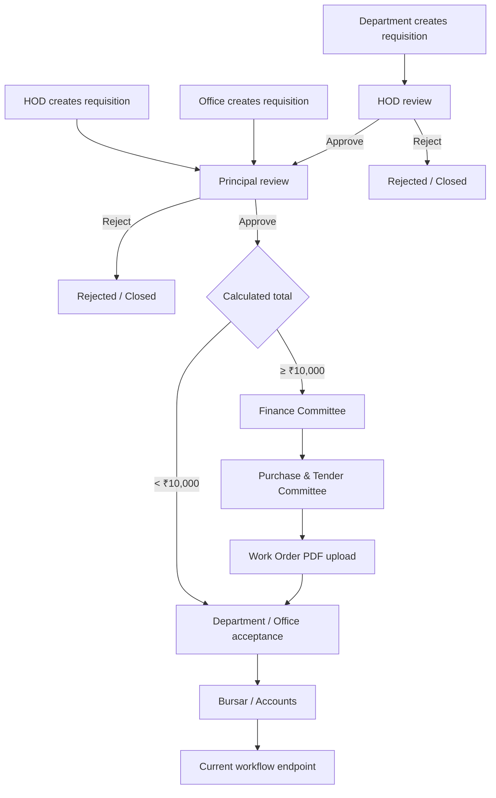
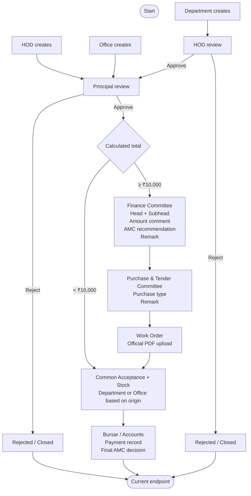

# Procurement Workflow — Final Business Specification

> **Purpose:** This is the business source of truth for the procurement workflow redesign. The application already has a partial implementation. Inspect the existing project first and adapt it to this specification. Do not blindly rebuild unrelated functionality or prescribe a specific code architecture.

## 1. Target Workflow

There are three requisition creators:

- **Department**
- **Office**
- **HOD**

Entry paths:



### Core routing rules

1. **Department-created:** Department → HOD → Principal.
2. **HOD-created:** HOD → Principal. HOD approval is skipped because the HOD is the creator. The requisition belongs to the HOD's own department.
3. **Office-created:** Office → Principal. HOD approval is skipped.
4. HOD has two capabilities: review pending department requisitions and create a new requisition.
5. HOD rejection and Principal rejection are **terminal**. There is no return, revision, send-back, or resubmission flow.
6. After Principal approval:
   - **Total < ₹10,000:** go directly to the common acceptance stage.
   - **Total ≥ ₹10,000:** Finance Committee → Purchase & Tender Committee → Work Order Upload → common acceptance stage.
7. Exactly **₹10,000** follows the Finance Committee route.
8. The ₹10,000 rule changes only the **purchasing/financial route**. It does **not** create a different acceptance process.
9. The total used for routing must come from the application's calculated item totals (quantity × unit price), not a client-supplied total.

---

## 2. Requisition Preparation

Department, Office, or HOD can create a requisition.

The initial requisition describes the required item/specification. A specific brand should **not** be selected during preparation.

The creator must answer:

**Does this product require Annual Maintenance?**

- Yes
- No

This is the **initial AMC requirement/preference**, not the final decision.

The department for an HOD-created requisition is the HOD's own department.

---

## 3. HOD Review

Only department-created requisitions pass through HOD review.

HOD can:

- Approve
- Reject

A decision remark is mandatory.

Rejecting a requisition permanently ends it as rejected/closed.

There is no revision or return path.

---

## 4. Principal Review

All non-rejected requisitions reach Principal:

```text
Department → HOD → Principal
HOD → Principal
Office → Principal
```

Principal can:

- Approve
- Reject

A decision remark is mandatory.

Rejection is terminal: **Rejected / Closed**.

There is no revision or return path.

---

## 5. Finance Committee — Only for ≥ ₹10,000

Finance Committee is used only when the calculated total is **₹10,000 or more**.

The Finance stage records:

### Head — mandatory

- Recurring
- Fixed Asset
- Other

If **Other** is selected, custom head text is required.

### Subhead — mandatory

Free-text subhead.

### Amount

The original requisition amount is tentative.

Finance does **not** determine the final actual purchase amount at this stage. The actual amount is established later during procurement and payment.

Finance may record an amount-related remark/comment and, only where supported by the existing application, an indicative/recommended finance amount. Do not treat this as the final purchase amount.

### AMC recommendation

Finance must answer:

**Finance Recommendation: Does this product require Annual Maintenance?**

- Yes
- No

This is only a **recommendation**. It does not override the original request and is not the final AMC decision.

### Remark

Finance must provide a mandatory remark before forwarding.

---

## 6. Purchase & Tender Committee

For the ≥ ₹10,000 branch, the Purchase & Tender Committee selects the purchase method:

- Direct
- Quotation
- Tender
- E-Tender
- Other

If **Other** is selected, custom text is required.

A remark is mandatory.

After this stage, the process moves to Work Order upload.

---

## 7. Work Order Upload

The college creates the official Work Order outside the application.

The application only stores the generated Work Order document.

Rules:

- Upload is mandatory before continuing.
- **PDF only.**
- No image or office-document formats.
- No Work Order number/date fields are required for the current scope.
- No remark is required.

Expected progression:


---

## 8. Common Acceptance + Stock Information

Acceptance is one common stage for **both amount branches**.

The authority is determined by **requisition origin**, not by the ₹10,000 threshold.

### Department-origin

If the requisition was created by either:

- Department, or
- HOD

it is accepted by the **relevant department**.

For an HOD-created requisition, the HOD and the relevant department should have access to perform/verify acceptance according to the existing role model.

Examples:

```text
CS Department creates
    ↓
CS Department acceptance
```

```text
CS HOD creates
    ↓
CS Department / HOD acceptance
```

### Office-origin

If Office created the requisition:

```text
Office creates
    ↓
Office acceptance
```

### Purpose

This stage confirms that the purchased item has arrived and records the actual received product/stock information.

The specific brand is recorded here because the initial requisition should describe the required specification rather than commit to a brand.

### Current item fields

Use the existing model where possible. The current target set is:

- Product Name
- Brand Name
- Type / Specification
- Manufacturing Date
- Expiry Date
- Quantity / Units
- Item ID / Asset ID
- Acceptance Date
- Accepted By
- Remarks

For this phase, these product-specific fields are generally **not mandatory** unless already required by the existing application.

The Item ID / Asset ID should be designed so the college can later introduce its own department/asset identification scheme.

---

## 9. Bursar / Accounts

Bursar and Accounts are one role for the current scope.

This is the current final active workflow stage.

Record:

- Cheque Number
- Transaction Number / Payment ID
- Payment Date
- Payment Amount
- Cheque / Payment PDF

Only **PDF** is accepted for the payment/cheque document.

No additional Bursar remark is required.

### Final AMC decision

At this stage, show the previous AMC values:

```text
Initial requester AMC preference
Finance Committee AMC recommendation
```

Then Bursar / Accounts records:

**Final Annual Maintenance Decision**

- Yes
- No

This is the **only authoritative AMC decision**.

Earlier AMC values remain as historical/contextual information and must not override the final decision.


For the current phase, do not add a detailed AMC Officer workflow or a separate AMC approval chain.

---

## 10. Current Endpoint / Future Extension

For this implementation phase, the active workflow ends at **Bursar / Accounts**.

The intended future direction is:

```text
Bursar / Accounts
    ↓
Utilization Certificate
    ↓
AMC processing, if applicable
    ↓
Final closure
```

The final UC template and AMC process have not yet been specified.

Therefore:

- Do not invent a detailed UC process.
- Do not invent a detailed AMC Officer process.
- Keep the design extensible for both.
- Do not add unsupported states or approvals.
- Treat Bursar / Accounts as the current endpoint.

---

## 11. Procurement Reports

Bursar / Accounts need a report facility for completed/accepted procurement records.

**Rejected requisitions are not completed purchases and must be excluded from purchase reports.**

### Filters

Support:

- From date
- To date

This must support monthly, yearly, and custom date-range reporting.

Use the most appropriate existing authoritative procurement/purchase date. Do not invent a new date field unless the current data model requires it.

Useful filters, where supported by existing data:

- Department
- Procurement ID
- Category
- Purchase type
- Head
- Subhead
- Vendor
- AMC decision
- Other relevant procurement fields

Do not add filters purely for visual completeness.

### Report contents

The report should be a clear, maintainable table using available data, potentially including:

- Procurement ID
- Procurement date
- Department
- Item / Product
- Quantity
- Brand
- Item / Asset ID
- Vendor
- Purchase type
- Head
- Subhead
- Amount
- AMC status
- Other relevant final procurement information

The filtered report must be exportable as a professional PDF.

Recommended access principle:

- Bursar / Accounts: full procurement reporting.
- Principal / authorized administration: full reporting where permitted by the existing authorization model.
- Department/HOD: appropriately scoped records only.
- Other roles: only data necessary for their responsibilities.

---

## 12. Procurement PDF

Authorized users should be able to generate/view the procurement PDF at relevant stages.

The PDF must:

- Reflect the current procurement state.
- Show information recorded up to that stage.
- Preserve earlier-stage information.
- Avoid displaying future-stage information as completed.
- Use human-readable workflow terminology.
- Never expose backend enum names or technical transition strings.

The PDF should be an official administrative record, not a raw audit log.

### PDF history

Show a concise, human-readable processing history, for example:

```text
Requisition Submitted
Recommended by Head of Department
Approved by Principal
Approved for Direct Purchase
Purchase/Tender Decision Recorded
Work Order Uploaded
Acceptance Completed
Payment Recorded
```

Do not expose values such as:

```text
PRINCIPAL_APPROVE_DIRECT
DIRECT_PURCHASED
PRINCIPAL_REVIEW->DIRECT_PURCHASE
DEPARTMENT_USER
```

The complete technical audit trail remains a separate application concern.

---

## 13. Access and Responsibilities

The following is the business intent; integrate it with the existing authentication/authorization design.

| Role | Main responsibility |
|---|---|
| Department | Create requisitions; accept department-origin procurements |
| HOD | Create requisitions; review department requisitions; participate in relevant department acceptance |
| Office | Create requisitions; accept office-origin procurements |
| Principal | Approve/reject all requisitions reaching Principal |
| Finance Committee | Review ≥₹10,000; Head/Subhead; amount comment; AMC recommendation |
| Purchase & Tender Committee | Select purchase method; forward |
| Work Order User/Officer | Upload official Work Order PDF |
| Bursar / Accounts | Record final payment; make final AMC decision; access procurement reports |

Apply existing institution/department scoping wherever applicable.

---

## 14. Rejection and Data Rules

### Rejection

Rejected requisitions are terminal.

Do not add:

- Return
- Revision
- Send Back
- Resubmit
- Approval loops

unless a later business specification explicitly requires them.

### Amount

The ₹10,000 routing decision uses the server/application-calculated total from requisition items.

### Brand

Initial requisition: specification only.

Acceptance stage: actual product/brand details.

### AMC

Maintain three distinct concepts:

1. Initial requester preference
2. Finance Committee recommendation
3. Bursar / Accounts final decision

Only #3 is authoritative.

### Purchase amount

Do not treat the tentative requisition amount or any Finance-stage indicative amount as the final actual purchase amount.

### Rejected records

Keep rejected records for historical/audit purposes, but exclude them from completed procurement purchase reports.

---

## 15. Implementation Approach

Use this document as the **business source of truth** and the existing codebase as the **technical source of truth for what already exists**.

Before making major changes:

1. Inspect the current workflow/state model.
2. Inspect roles and permissions.
3. Inspect requisition, item, finance, purchase/tender, Work Order, acceptance/stock, payment, history/audit, and file models.
4. Inspect the existing API and frontend handling for each stage.
5. Identify what already satisfies this specification.
6. Change only what is necessary to bring the application into alignment.
7. Reuse existing structures where appropriate instead of creating duplicate parallel systems.
8. Retire conflicting workflow paths.
9. Preserve unrelated working functionality.
10. Keep the future UC/AMC extension possible without implementing unsupported rules.

Do not assume the current implementation is correct just because a similar stage already exists. Compare actual behavior against this specification.

---

## 16. Acceptance Checklist

### Creation and routing
- [ ] Department can create a requisition.
- [ ] Office can create a requisition.
- [ ] HOD can create a requisition.
- [ ] HOD-created requisition belongs to the HOD's department.
- [ ] Department-created requisition goes to HOD.
- [ ] HOD-created requisition goes directly to Principal.
- [ ] Office-created requisition goes directly to Principal.

### Approvals
- [ ] HOD can approve/reject department-created requisitions.
- [ ] HOD decision requires a remark.
- [ ] HOD rejection is terminal.
- [ ] Principal can approve/reject.
- [ ] Principal decision requires a remark.
- [ ] Principal rejection is terminal.
- [ ] No revision/return/resubmission flow exists.

### Amount routing
- [ ] Total is calculated from item quantity × unit price.
- [ ] `< ₹10,000` bypasses Finance/Purchase-Tender and goes to common acceptance.
- [ ] `≥ ₹10,000` goes to Finance.
- [ ] Exactly `₹10,000` goes to Finance.
- [ ] Acceptance authority does not change based on amount.

### Finance
- [ ] Head is mandatory.
- [ ] Recurring / Fixed Asset / Other are available.
- [ ] Other requires custom text.
- [ ] Subhead is mandatory.
- [ ] Finance can record amount-related commentary.
- [ ] Finance records AMC recommendation.
- [ ] Finance remark is mandatory.

### Purchase/Tender
- [ ] Direct / Quotation / Tender / E-Tender / Other are available.
- [ ] Other requires custom text.
- [ ] Remark is mandatory.

### Work Order
- [ ] Official Work Order PDF is mandatory before forwarding.
- [ ] PDF is the only accepted format.
- [ ] No unsupported Work Order metadata is required.
- [ ] No remark is required.

### Acceptance
- [ ] Department-origin requisitions go to the relevant department.
- [ ] HOD-origin requisitions go to the relevant department/HOD acceptance context.
- [ ] Office-origin requisitions go to Office.
- [ ] Acceptance is common to both amount branches.
- [ ] Actual product/brand/stock details can be recorded.
- [ ] Current product-specific fields remain configurable/mostly optional.

### Bursar / Accounts
- [ ] Payment details are recorded.
- [ ] Cheque number is recorded.
- [ ] Transaction/payment ID is recorded.
- [ ] Payment date is recorded.
- [ ] Payment amount is recorded.
- [ ] Payment/cheque PDF is accepted.
- [ ] PDF is the only accepted upload format.
- [ ] Previous AMC values are visible.
- [ ] Final AMC decision is recorded.
- [ ] Final AMC decision is authoritative.

### Reports
- [ ] Rejected records are excluded from completed purchase reports.
- [ ] Date-range filtering works.
- [ ] Monthly/yearly/custom reports can be produced.
- [ ] Relevant procurement data appears in a table.
- [ ] Filtered report can be generated as PDF.

### Procurement PDF
- [ ] Authorized users can generate the PDF at relevant stages.
- [ ] PDF reflects information available at the current stage.
- [ ] Processing history is human-readable.
- [ ] Backend state/action names are hidden.
- [ ] Future-stage data is not shown as completed.

---

## 17. High-Level Reference Diagram



## 18. What Is Intentionally Deferred

Do not implement detailed rules for these until the college provides them:

- Utilization Certificate template/process
- AMC Officer workflow/process
- Post-Bursar closure rules beyond the current endpoint
- College-specific Asset/Item ID generation rules
- Additional institutional fields not supported by the current requirements

These should be designed so they can be added later without restructuring the core workflow.

